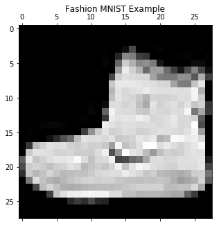

# Model Validation: How to Know How Much Your Model Knows

- Matthew Emery - Senior Data Scientist @ [Imbellus Inc.](https://www.imbellus.com/#/)
- www.matthewemery.ca
- Find the code at https://github.com/lstmemery/lunch-and-learn-validation

## What Are We Covering?

 1. Quick explainer on Fashion MNIST and Decision Trees
 2. Overfitting Explanation
 3. The Golden Rule of Machine Learning
 4. Optimization Bias and Cross-Validation


```python
from sklearn.tree import DecisionTreeClassifier, export_graphviz
import gzip
import matplotlib.pyplot as plt
from sklearn.model_selection import train_test_split, cross_val_score, RepeatedStratifiedKFold
from math import log, sqrt
from pathlib import Path
import numpy as np
import bokeh.plotting as bk
from tqdm import tqdm_notebook
import graphviz
import pandas as pd

fmnist_class_names = ["T-shirt", "Trouser", "Pullover", "Dress", "Coat",
                    "Sandal", "Shirt", "Sneaker", "Bag", "Ankle Boot"]

%matplotlib notebook
```


```python
with gzip.open(Path("data", "train-labels-idx1-ubyte.gz")) as label_path:
    labels = np.frombuffer(label_path.read(), dtype=np.uint8,
                           offset=8)

with gzip.open(Path("data", "train-images-idx3-ubyte.gz")) as image_path:
    features = np.frombuffer(image_path.read(), 
                           dtype=np.uint8, 
                           offset=16).reshape(len(labels), 784)
    
```


```python
plt.gray()
plt.matshow(features[0].reshape((28,28))) 
plt.title("Fashion MNIST Example")
plt.rcParams['figure.figsize'] = [50, 50]
plt.show()
```


    <Figure size 360x360 with 0 Axes>





- When I first wrote this tutorial I used MNIST
- Then I found out about Fashion MNIST
- Benefits:
    1. Harder than MNIST
    2. Less used than MNIST
    3. Better represents modern computer vision tasks
- How many of you have heard of MNIST?


## A Quick Explainer on Decision Trees


```python
graph_data = export_graphviz(models[1],
                            filled=True,
                            rounded=True,
                            class_names=fmnist_class_names)
graph = graphviz.Source(graph_data, format="png")
graph.render("decision_tree", "img")
```


    'img/decision_tree.png'


- A decision tree is trained by looking at each pixel value and seeing what breakpoint would split classes the best
- Pick the best pixel to split on and continue
- The size of the tree is a hyperparameter
- I decided to choose a decision tree to illustrate this for a couple of reasons
  1. Decision Trees are really easy to understand
  2. No need to do any preprocessing
  3. It shows that even very simple models can do simple computer vision tasks

## Train Test Split


```python
(train_features, validation_features,
 train_labels, validation_labels) = train_test_split(
    features,
    labels,
    random_state=0,
    shuffle=True,
    test_size=0.20, # This is fine enough
    stratify=labels
)
```

- This is the core way we evaluate models
- If we train on one dataset, how well does it do on the holdout?
- Always set a seed so you can compare 
- Test size is traditionally 80/20 - this mostly folk lore though
- Do not shuffle if you are dealing with time series
- Stratification is important when you are dealing with unbalanced labels


```python
models, train_scores = [], []

for depth in range(1, 20):
    model = DecisionTreeClassifier(max_depth=depth, random_state=0)
    model.fit(train_features, train_labels)
    
    score = model.score(train_features, train_labels)
    print("Depth:", depth, "Training Accuracy:", round(score, 2))
    models.append(model); train_scores.append(score)
```

    Depth: 1 Training Accuracy: 0.2
    Depth: 2 Training Accuracy: 0.36
    Depth: 3 Training Accuracy: 0.5
    Depth: 4 Training Accuracy: 0.65
    Depth: 5 Training Accuracy: 0.71
    Depth: 6 Training Accuracy: 0.74
    Depth: 7 Training Accuracy: 0.78
    Depth: 8 Training Accuracy: 0.81
    Depth: 9 Training Accuracy: 0.83
    Depth: 10 Training Accuracy: 0.85
    Depth: 11 Training Accuracy: 0.87
    Depth: 12 Training Accuracy: 0.89
    Depth: 13 Training Accuracy: 0.91
    Depth: 14 Training Accuracy: 0.93
    Depth: 15 Training Accuracy: 0.94
    Depth: 16 Training Accuracy: 0.96
    Depth: 17 Training Accuracy: 0.97
    Depth: 18 Training Accuracy: 0.98
    Depth: 19 Training Accuracy: 0.98


```python
validation_scores = []

for depth, model in enumerate(models):
    score = model.score(validation_features, validation_labels)
    print("Depth:", depth, "Validation Accuracy:", round(score, 2))
    validation_scores.append(score)
```

    Depth: 0 Validation Accuracy: 0.2
    Depth: 1 Validation Accuracy: 0.36
    Depth: 2 Validation Accuracy: 0.5
    Depth: 3 Validation Accuracy: 0.65
    Depth: 4 Validation Accuracy: 0.71
    Depth: 5 Validation Accuracy: 0.73
    Depth: 6 Validation Accuracy: 0.76
    Depth: 7 Validation Accuracy: 0.78
    Depth: 8 Validation Accuracy: 0.8
    Depth: 9 Validation Accuracy: 0.81
    Depth: 10 Validation Accuracy: 0.81
    Depth: 11 Validation Accuracy: 0.81
    Depth: 12 Validation Accuracy: 0.82
    Depth: 13 Validation Accuracy: 0.81
    Depth: 14 Validation Accuracy: 0.81
    Depth: 15 Validation Accuracy: 0.81
    Depth: 16 Validation Accuracy: 0.81
    Depth: 17 Validation Accuracy: 0.81
    Depth: 18 Validation Accuracy: 0.8


```python
plot_1 = bk.figure(title="Training vs. Validation Accuracy",
    )
plot_1.xaxis.axis_label = "Depth"
plot_1.yaxis.axis_label = "Accruacy"
plot_1.line(x = range(1, 20), y = train_scores, 
            line_width = 5, color = "blue", legend = "Training Accuracy")
plot_1.line(x = range(1, 20), y = validation_scores, 
            line_width = 5, color = "orange", legend = "Validation Accuracy")
bk.show(plot_1)
```


 - If you want to show Bokeh plots inline you need

`jupyter labextension install jupyterlab_bokeh`

## Overfitting

- The gap between training and validation accuracy is **overfitting**
 - **Interpretation**: Our model has memorized part of the data set instead of learning the underlying rules
 - If the validation accuracy was higher than our training that's **underfitting**

## Think About Studying for an Exam

- Training your model is like the model reviewing its notes
- Validating your model is when you take the midterm
- Deploying your model is the final

## Golden Rule of Machine Learning:

# The test cannot influence training in any way

- If you know the answers on the exam ahead of time, you won't know if you actually learned the material

## Common Mistakes

 - Time Series: Incorporating information from the future in your model (i.e. quarterly results before end of quarter)
 - Imputing based on the combined train-test dataset
 - Taking a peek on the test data halfway through training your model

## Should I Just Fit a Million Models Until I Find Something?

# No!

## An Illustration


 - Sign up for my service and I'll email you a prediction of whether or not the S&P 500 goes up or down that morning
 - Every work day for two week days I'm right
 - **What do you need to ask me before you should trust my model?**

## How Many Other People Did I Send Emails To?

- Two business weeks is 10 business days
$$2^{10} = 1024$$
- If I sent 1024 people different emails (Up, Down, Up etc.) I'm guarenteed to be right once

## The Same Thing Happens with Machine Learning Models

 - We call this **optimization bias**
 - Sometimes you find something that fits your validation data set through dumb luck

## How Do We Decrease the Effect of Optimization Bias?

- **Cross-validation** (or repeated cross-validation)
- Leave a **test set** that you evaluate very rarely (one a week or less)
- Set a limit to the number of models you will evaluate

## Cross-Validation


```python
cv_scores = []
for depth in range(1, 20):
    model = DecisionTreeClassifier(
        max_depth=depth,
    random_state=0)
    
    cv_score = cross_val_score(
        model,
        features,
        labels,
        cv = 5,
        n_jobs = -1
    )
    
    print("Depth:", depth,
          "Mean:", round(np.mean(cv_score), 2), 
          "SD:", round(np.std(cv_score), 3))
    
    cv_scores.append(cv_score)
```

    Depth: 1 Mean: 0.2 SD: 0.0
    Depth: 2 Mean: 0.36 SD: 0.002
    Depth: 3 Mean: 0.5 SD: 0.003
    Depth: 4 Mean: 0.65 SD: 0.002
    Depth: 5 Mean: 0.71 SD: 0.003
    Depth: 6 Mean: 0.73 SD: 0.003
    Depth: 7 Mean: 0.76 SD: 0.003
    Depth: 8 Mean: 0.79 SD: 0.002
    Depth: 9 Mean: 0.8 SD: 0.002
    Depth: 10 Mean: 0.81 SD: 0.003
    Depth: 11 Mean: 0.81 SD: 0.004
    Depth: 12 Mean: 0.81 SD: 0.003
    Depth: 13 Mean: 0.81 SD: 0.003
    Depth: 14 Mean: 0.81 SD: 0.002
    Depth: 15 Mean: 0.81 SD: 0.003
    Depth: 16 Mean: 0.81 SD: 0.004
    Depth: 17 Mean: 0.81 SD: 0.004
    Depth: 18 Mean: 0.81 SD: 0.004
    Depth: 19 Mean: 0.81 SD: 0.005


```python
plot_2 = plot_1

plot_2.line(x = range(1, 20), y = np.mean(cv_scores, axis=-1), 
            line_width = 5, color = "purple", legend = "Cross Validation Accuracy")
bk.show(plot_2)
```


- Notice that this doesn't change much
- This is because we already have sufficient data to get an accurate result
- Try this on a smaller dataset
- This is good news, cross-validation takes longer than validation

## Summary

 - Always create a validation set (cross-validation if you have a small amount of data)
 - Never let information from your validation set leak into to your training
 - Don't train models for no reason

## Bibliography


[1] “Data splitting | Machine Learning.” [Online]. Available: https://www.includehelp.com/ml-ai/data-splitting.aspx. [Accessed: 17-Mar-2019].

[2]“1.10. Decision Trees — scikit-learn 0.20.3 documentation.” [Online]. Available: https://scikit-learn.org/stable/modules/tree.html#tree. [Accessed: 17-Mar-2019].

[3]M. Schmidt, “DSCI 573: Model Selection and Feature Selection 1.”

[4]T. Sarkar, “How to analyze ‘Learning’: Short tour of computational learning theory,” Towards Data Science, 26-Oct-2018. [Online]. Available: https://towardsdatascience.com/how-to-analyze-learning-short-tour-of-computational-learning-theory-9d93b15fc3e5. [Accessed: 03-Mar-2019].

[5]A MNIST-like fashion product database. Benchmark :point_right: : zalandoresearch/fashion-mnist. Zalando Research, 2019.

[6]I. Guyon and T. B. Laboratories, “A scaling law for the validation-set training-set size ratio,” p. 11.
